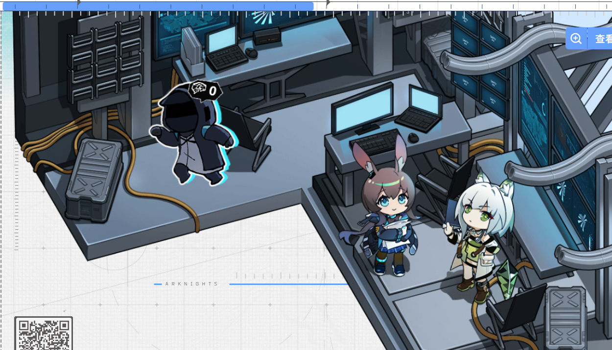

# 添加自定义的干员小人到地图上

目前还在开发中。主要问题在于，官方的干员小人的初始状态是硬编码在地图上的，需要实现一个把自定义干员小人的初始状态添加到地图上的方法。

计划的方案是，对于每一级地图（共 4 级），都使用一张对应的 png，覆盖到原始图像上。

将所有内容压缩为.zip，通过控制页添加。

## 角色包内包含的文件

### avatar.png

干员头像。大小建议 520x440

### full.png

干员立绘。尺寸无要求。

### face.png 和 face_active.png

干员表情差分。宽高要和`full.png`保持一致。

### mask.png

可以参考`arknights-echoes-of-terra-resources.zip\arknights\activity\echoes-of-terra\mapResource\characters\`下官方角色包内的`mask.png`。

### meta.json

```jsonc
{
  /** 干员id。如果id以“char_”开头，则视为官方干员，点击时可触发播放语音。 */
  "id": "doctor",
  /** 干员名称 */
  "name": "博士",
  /** 英文代号 */
  "appellation": "Doctor",
  /** 职业 */
  "profession": "CASTER",
  /** 搜索栏使用的关键词。匹配方式为 keywords.includes(searchText) */
  "keywords": "doctor",
  /** 干员所在房间的id */
  "roomId": "06",
  /** 干员的位置（从房间的左上角开始） */
  "offset": { "x": 284, "y": 580 },
  /** 干员是否有遮罩 */
  "noMask": false,
  /** 干员图层层级 */
  "zIndex": 3,
  /** 干员尺寸 */
  "size": { "x": 189, "y": 240 },
  /** 暂未确定，用于确定需要修改的地图区块 */
  "modifiedBlocks": [
    {
      "blocks": ["r_1_42_505_495", "r_1_42_506_495"],
      "zIndex": 1
    }
  ]
}
```

example 中的干员是博士，它在阿米娅所在房间的偏左上角。


